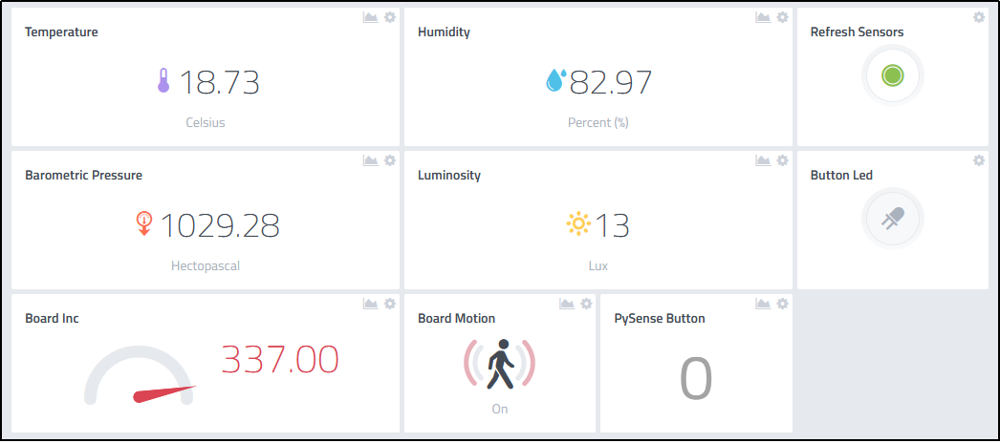

# Sensors-Network-with-LoRa-Lopy-using-MQTT
This was a little project we did a while back, and the idea was to make a small sensors network to experimenting around IoT (Internet of Things).
So we used this little microcontroller, the LoPy, with a development board, the PySense, which contains a bunch of sensors.
The sensors data is send from the PySense to the LoPy, and then processed and transmitted via WiFi to a MQTT broker, we used the cayenne mqtt.mydevices.com broker.
Then at mqtt.mydevices.com we created an account and created a dashboard that displays all of the data. This data can then be accessed by anywhere in the world. 

This is how our dashboard looks like:

And this is the hardware that we used:
!LoPy](LoPy.png)

